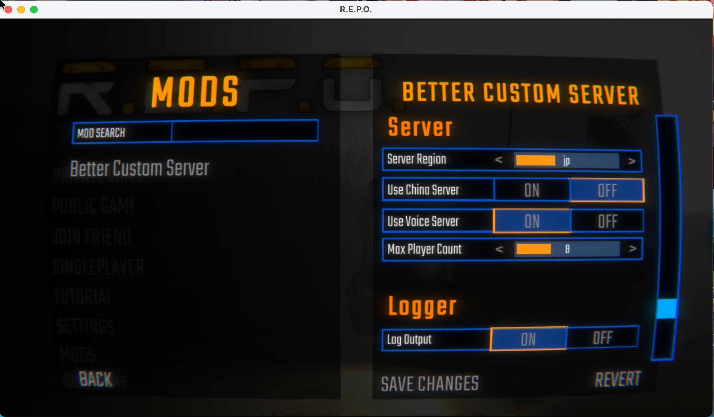
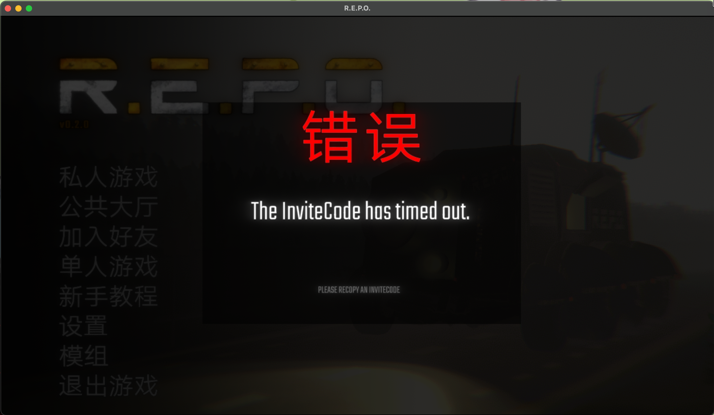

# BetterCustomServer

&nbsp;&nbsp;&nbsp;&nbsp;&nbsp;&nbsp;&nbsp;&nbsp;或许是功能更多的自定义服务器Mod（?）

## 介绍
1. 允许玩家自定义服务器，包括中国区，使用 邀请码 的方式加入游戏。
2. 去除了游戏的 选择区域界面 以及 大厅密码。
3. 你与你的伙伴都需要安装该Mod，作为 房主 的需要完成所有的安装步骤，作为 房员 则只需要安装Mod。
4. 邀请码具有时效性，仅在 当前小时内 有效，房员进入房间后将拥有 临时的创建房间的能力 ，用来解决房主网络太差，但别人又开不了房间的情况。
5. 该Mod移除了 PUBLIC GAME 的功能，因为我不会做。
6. 对游戏后台异常日志输出进行了大量精简。

## 安装方法
将Mod放置在BepInEx/plugins中。
该Mod需要你去Photon Cloud创建自己的服务器ID来使用（免费）。
### 一、创建 Photon 服务器
1. 前往 [Photon Engine](https://www.photonengine.com/) 注册/登录账号。
2. 再进入 [仪表盘](https://dashboard.photonengine.com/)。
3. 创建应用程序，Photon SDK类型分别为`Voice（可选）`、`Pun`。

### 二、申请中国区ID（可选）
1. 前往 [中国区光子云](https://vibrantlink.com/chinacloudapply) 填写申请表格。
2. appId类型选择`Pun`，`Voice`类型不可申请。
3. `appId`中填写你的 Photon Pun 服务的 AppId。
4. 必填项填写完毕后提交，一般等待 3-7天 将会收到回复邮件。
5. 更改Mod配置`Use China Server`为`true`。
Tip: 其实hk的延迟也挺不错的，在我这边hk比cn延迟还要低。

### 三、配置设置
1. (国际区Photon Pun) 在C盘下创建`PhotonPunGlobal.txt`，内容为你的`Photon Pun`的`AppId`。
2. (中国区Photon Pun) 在C盘下创建`PhotonPunChina.txt`，内容为`回复邮件`中提供给你的`AppId`。
3. (可选) 在C盘下创建`PhotonVoice.txt`，内容为你的`Photon Voice`服务的`AppId`。

## 用法
### 房主

<ul>
   <li>该Mod使用邀请码方式加入游戏，创建房间后会自动将邀请码复制到剪贴板，你只需要将邀请码发送给你的伙伴。</li>
   <li>若不小心把邀请码弄没了，可以在大厅界面点击邀请按钮重新复制邀请码。</li>
</ul>

### 房员

<ul>
   <li>复制房主发送过来的邀请码，再点击<code>JOIN FRIEND</code>即可进入房间。</li>
</ul>

## 支持REPOConfig Mod

## 大厅页面

## 邀请码功能（错误演示）

